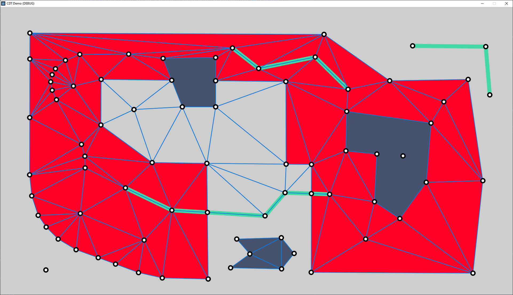

# Godot-CDT
Conforming Delaunay triangulations [GDExtension](https://docs.godotengine.org/en/stable/tutorials/scripting/gdextension/what_is_gdextension.html) for Godot 4.  This is a wrapper for [artem-ogre/CDT](https://github.com/artem-ogre/CDT) C++ library.  Inspired by [cdt-gd](https://github.com/sheepandshepherd/cdt-gd) which works with Godot 3. 

I have not yet added every function of the original library to this extension.  Feel free to make a pull request if you add more!



## Installing
To install this library download a [release](https://github.com/path9263/godot-cdt/releases) which works with your version of Godot.  Extract the `bin` folder and place it in the same folder as your `godot.project` file. 

## Using this Extension
This GDExtension is a wrapper for [artem-ogre/CDT](https://github.com/artem-ogre/CDT) C++ library, refer to the documentation there for more detail.

### Demo:
This github repo contains a demo folder with a Godot project which makes use of many of the features of this extension.  

### Basic Use:

- Create a new `ConstrainedTriangulation` Resource.  You may wish to call the `init` function on it before adding data to it as the init function clears all data.  The init function can be used to change the vertex insertion order, determine if overlapping constrained edges should be merged, and set the min distance to merge.  
- Create a `PackedVector2Array` of vertices you want to triangulate.  Add your array of vertices‎ with `insert_vertices(verts)`, always add the vertices array before adding the array of edges.
- Create a `PackedInt32Array` of edges which you want to constrain.  This is an array of vertex indices in the PackedVector2Array of vertices you created.  You can use either `insert_edges(edges)` **or** `insert_conforming_edges(edges)` to add your edges depending on your use case.  
- Generate your triangulation with **one** of the following methods: 
    - `cdt.erase_super_triangle()`
    - `cdt.erase_outer_triangles()`
    - `cdt.erase_outer_triangles_and_holes()`
- You can now access generated vertices and triangles by calling `get_all_vertices()` and `get_all_triangles()`.  The returned array of triangles is a ‎PackedInt32Array‎, every 3 consecutive values represent a triangle.  The values are the indexes of the vertices in the returned vertices array.

```
extends Node2D

var cdt: ConstrainedTriangulation = ConstrainedTriangulation.new()

var verts: PackedVector2Array = [Vector2(240, 144), Vector2(492, 603), Vector2(763, 546), Vector2(819, 296)]
var tris: PackedInt32Array
var edges: PackedInt32Array = [0,1,1,2,2,3,3,0]

func _ready():
	cdt.init(true, true, 0.1) 

	var edge_count: int = 0

	# always insert all vertices before any constrained edges
	cdt.insert_vertices(verts)

	# use one of the two methods below: 
	cdt.insert_edges(edges)
	#cdt.insert_conforming_edges(edges)

	# do one of the three below options to generate triangles: 
	#cdt.erase_super_triangle()
	#cdt.erase_outer_triangles()
	cdt.erase_outer_triangles_and_holes()

	verts = cdt.get_all_vertices()
	tris = cdt.get_all_triangles()

func _draw():
	for tri in tris.size() / 3:
		for i in 3:
			var from = verts[tris[3*tri + i]]
			var to = verts[tris[3*tri + (i+1)%3]]
			draw_line(from, to, Color(0.07, 0.47, 0.85), 1.0, true )
	for v in verts.size():
		var vert = verts[v]
		draw_circle(vert, 10, Color(0,0,0))
		draw_circle(vert, 5, Color(1,1,1))
```
## Building the  Extension 
This GDExtension more or less follows [this guide](https://docs.godotengine.org/en/stable/tutorials/scripting/gdextension/gdextension_cpp_example.html#doc-gdextension-cpp-example).  Some files are located in different directories. 
